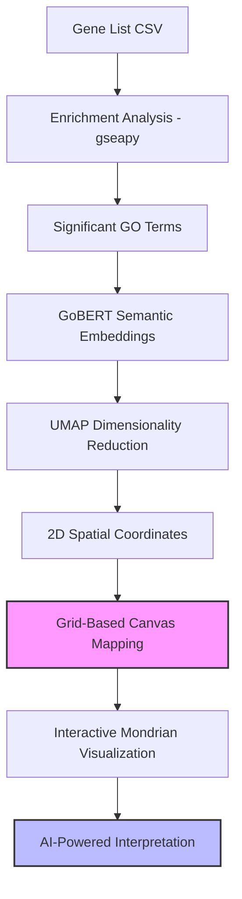

# MondrianMap: Navigating gene set hierarchies with multi-resolution enrichment maps

**A visualization tool that allows hierarchical visualization of enriched gene sets and their cross-talks for biological case studies**

<p align="left">
  <a href="https://mondrianmap.smartdrugdiscovery.org/" target="_blank" rel="noopener noreferrer">WebApp</a> •
  <a href="https://github.com/aimed-lab/mondrian-web" target="_blank" rel="noopener noreferrer">GitHub</a>
</p>

The Common Fund Data Ecosystem (CFDE) integrates NIH Common Fund resources by harmonizing evidence at the gene-set/signature level, enabling cross-study functional comparisons. Yet enrichment analyses typically yield long, redundant term lists that obscure hierarchical relationships among gene sets and pathways. We developed MondrianMap, a free web server that converts enrichment outputs into interactive, Mondrian-style rectangular maps and supports multi-resolution navigation across discretized semantic layers, from specific terms to broad umbrella processes. MondrianMap groups semantically related gene sets using embedding-based similarity to reduce redundancy, and encodes effect direction and magnitude alongside significance in a single view with zoomable drill-down. In representative transcriptomic and multi-omics case studies, MondrianMap reveals coherent functional modules and stable higher-level processes while exposing finer-grained substructures that are difficult to recover from conventional dot and bar plots. MondrianMap makes CFDE gene set hierarchies tractable for exploratory analysis, accelerating hypothesis generation and reuse of integrated functional knowledge.

---

## Scientific & Methodological Pipeline

MondrianMap implements a multi-stage pipeline designed to preserve both the statistical significance and semantic relationships of biological pathways.



### 1. Enrichment Analysis
Identifies significant Gene Ontology (GO) terms from user-uploaded gene lists using **gseapy** with Benjamini-Hochberg FDR correction.

### 2. Semantic Embedding (GoBERT)
Uses **GoBERT**, a specialized BERT-based transformer model, to generate 768-dimensional embeddings for each GO term. This captures the deep functional meaning of biological processes.

### 3. Spatial Optimization (UMAP)
High-dimensional embeddings are projected onto a 2D plane using **UMAP** (Uniform Manifold Approximation and Projection) with a cosine similarity metric. This ensures that biologically related pathways naturally cluster together spatially.

### 4. Mondrian Aesthetic Rendering
*   **Grid Alignment**: Strict 10px grid on a 1000x1000 canvas.
*   **Significance-Based Sizing**: Block area proportional to statistical significance ($-log_{10}(p)$).
*   **Regulation-Based Coloring**: 🟥 Red (Up), 🟦 Blue (Down), 🟨 Yellow (Shared).

---

## Key Features

*   **AI Hypothesis Engine**: LLM-integrated interpretation to hypothesize mechanistic links between enriched clusters.
*   **Multi-Resolution Navigation**: Supports 13 layers of GO hierarchy (via the **GOALS** framework), allowing zoomable drill-down from broad processes to specific terms.
*   **Dynamic Filtering**: Real-time control over block size, spacing, significance, and Jaccard crosstalk thresholds.
*   **Interactive Crosstalk**: Visualizes functional overlaps between pathways using Jaccard Similarity.

---

## Setup & Installation

### Web Application
1.  **Clone the repository**:
    ```bash
    git clone https://github.com/aimed-lab/mondrian-web.git
    ```
2.  **Install dependencies**:
    ```bash
    npm install
    ```
3.  **Start development server**:
    ```bash
    npm run dev
    ```

### Data Processing Pipeline
1.  **Install Python requirements**:
    ```bash
    cd python
    pip install -r requirements.txt
    ```

---

## Data Management

### Ingesting New Datasets
To ingest a new perturbation GMT file into the Mondrian Map database system, use the `ingest_database.py` script.

**Command:**
```bash
python python/ingest_database.py <path_to_gmt> --id <db_id> --name <display_name> [options]
```

**Example:**
```bash
python python/ingest_database.py data/LINCS_L1000.gmt \
    --id LINCS \
    --name "LINCS L1000" \
    --label-type "Drug Perturbation" \
    --description "LINCS L1000 Chemical Perturbation Signatures"
```

**Options:**
- `--id`: Short database identifier (e.g., LINCS).
- `--name`: Display name shown in the webapp dropdown.
- `--label-type`: Label for the dropdown categories (e.g., "Compound").
- `--shard-size`: Target shard size in MB (default: 5) for efficient loading.
- `--single-dir`: If set, treat all entries as unidirectional (no Up/Down pairing).

---

## Authors & Contact

**Authors**: Fuad Al Abir, Zongliang Yue, Ehsan Saghapour, Md Delower Hossain, Zhandos Sembay, Sixue Zhang, Jake Y. Chen.

**Correspondence**: <a href="mailto:jakechen@uab.edu">jakechen@uab.edu</a>

---

## Citations

If you use MondrianMap in your research, please cite:

**Mondrian Abstraction and Language Model Embeddings for Differential Pathway Analysis**
> Al Abir, F., & Chen, J. Y. (2024). 2024 IEEE International Conference on Bioinformatics and Biomedicine (BIBM).
> <a href="https://doi.org/10.1101/2024.04.11.589093" target="_blank" rel="noopener noreferrer">DOI: 10.1101/2024.04.11.589093</a>

**GOALS: Gene Ontology Analysis with Layered Shells for Enhanced Functional Insight and Visualization**
> Yue, Z., Welner, R. S., Willey, C. D., Amin, R., Li, Q., Chen, H., and Chen, J. Y. (2025).
> <a href="https://doi.org/10.1101/2025.04.22.650095" target="_blank" rel="noopener noreferrer">DOI: 10.1101/2025.04.22.650095</a>